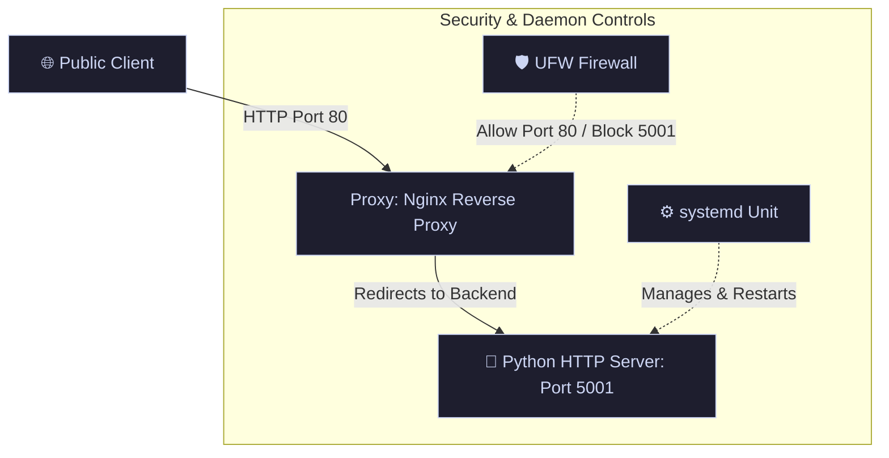
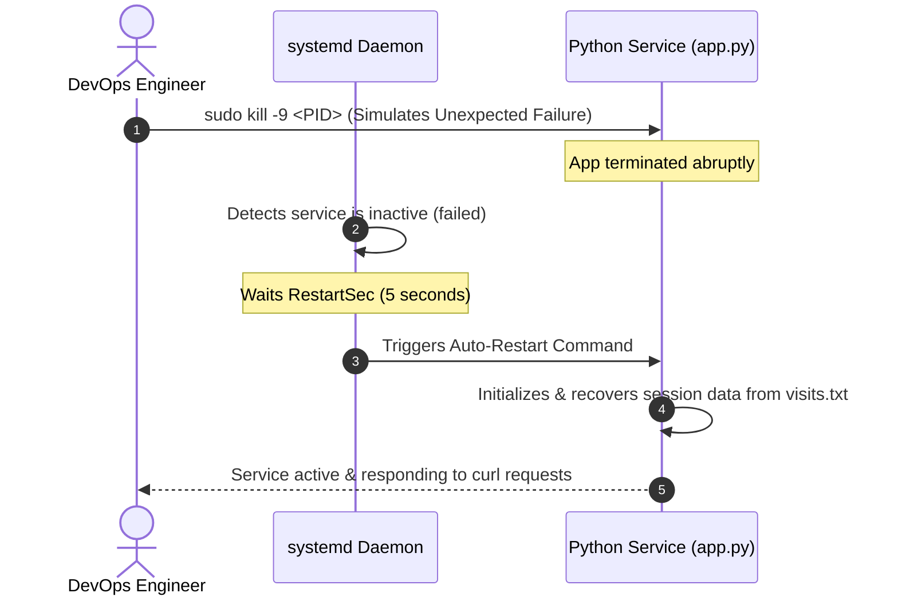

# 🚀 Learnix Labs Linux & DevOps Internship

<div align="center">

[](https://github.com/Akashdeep7226)
[](https://github.com/Akashdeep7226)
[](https://github.com/Akashdeep7226)

</div>

---

## 📌 Project Overview

This repository contains my portfolio of solutions for the **Learnix Labs Linux & DevOps Internship**. The projects demonstrate progressive hands-on experience in Linux system administration, automated Bash scripting, systemd service management, secure Nginx reverse proxying, UFW firewall administration, data persistence, centralized logging, and self-healing service configurations.

---

## 🗂 Repository Structure

The project directory is structured as follows to separate configuration files, scripts, persistence databases, and verification artifacts:

```directory
.
├── app.py                  # Python HTTP Server serving on port 5001 (Week 2/3/4)
├── monitor1.sh             # Linux resource monitoring script (Week 1)
├── setup.sh                # End-to-end infrastructure automation script (Week 3/4)
├── dummyapp.service        # custom systemd service configuration unit
├── nginx.conf              # Nginx reverse proxy configuration file
├── logs/
│   └── app.log             # Centralized application logs
├── data/
│   └── visits.txt          # Persistent data store (visitor counter)
├── screenshots/            # Verification & proof-of-concept screenshots
└── README.md               # Project documentation & walkthroughs
```

---

## 🌟 Weekly Breakdown & Features

### 📅 Week 1 – Linux Monitoring Script
**Objective:** Program a lightweight diagnostic utility to collect vital system resource statistics and automate execution.
*   **CPU Monitoring:** Tracks overall load metrics.
*   **Memory Monitoring:** Logs RAM usage (Used vs. Total).
*   **Disk Usage Monitoring:** Audits file system capacity limit indicators.
*   **Timestamp Logging:** Appends telemetry data to files with unified ISO timestamps.
*   **Cron Automation:** Configured via Crontab to run silently every 5 minutes.

📁 **Core File:** [`monitor1.sh`](file:///c:/Users/sudip/OneDrive/Desktop/learnix/monitor1.sh)

---

### 📅 Week 2 – systemd + Nginx + UFW
**Objective:** Deploy a Python microservice backend, configure a reverse proxy to manage external traffic, and secure the system using a firewall.
*   **Daemonization:** Run the Python app as a background service via a custom systemd service unit.
*   **Nginx Reverse Proxy:** Routes public HTTP traffic (Port `80`) to the underlying Python server (Port `5001`).
*   **UFW Security:** Closes non-essential ports, leaving only standard web traffic open.

📁 **Core Files:** [`app.py`](file:///c:/Users/sudip/OneDrive/Desktop/learnix/app.py) | [`dummyapp.service`](file:///c:/Users/sudip/OneDrive/Desktop/learnix/dummyapp.service) | [`nginx.conf`](file:///c:/Users/sudip/OneDrive/Desktop/learnix/nginx.conf)



---

### 📅 Weeks 3 & 4 – Infrastructure Automation & Resilience
**Objective:** Combine setup scripts and health checks into a single automated execution file (`setup.sh`) and build persistent systems with active recovery loops.
*   **Automated Provisioning:** Run [`setup.sh`](file:///c:/Users/sudip/OneDrive/Desktop/learnix/setup.sh) to automatically build directories, configure paths, copy systemd units, set up Nginx files, and enable firewall rules.
*   **Data Persistence:** Application state (e.g., visitor counting) is persisted in [`data/visits.txt`](file:///c:/Users/sudip/OneDrive/Desktop/learnix/data/visits.txt) and does not reset when the service restarts.
*   **Centralized Logging:** Consolidated operational and error outputs stream directly into [`logs/app.log`](file:///c:/Users/sudip/OneDrive/Desktop/learnix/logs/app.log).
*   **Failure Recovery:** The systemd service is configured with a failure-restart directive (`Restart=always`, `RestartSec=5`) to ensure automatic self-healing.



---

## 🛠 Command Reference & Orchestration

### ⚙️ Quick Start Installation

Execute the automation script to install packages, configure components, copy files, and start services:

```bash
# Clone the project repository
git clone https://github.com/Akashdeep7226/legal_document.git # Clones repository
cd learnix

# Week 1: Setup monitoring permissions and cron job
chmod +x monitor1.sh
./monitor1.sh

# Weeks 3 & 4: Launch the automated installer
chmod +x setup.sh
sudo ./setup.sh
```

---

### 🧪 Failure & Recovery Verification

Test system resilience by simulating an application crash:

```bash
# 1. Look up the process identifier (PID) of the running service
ps aux | grep app.py

# 2. Terminate the service unexpectedly
sudo kill -9 <PID>

# 3. Check systemd status immediately (verify self-healing process)
sudo systemctl status dummyapp

# 4. View real-time logs demonstrating restart and operations
sudo journalctl -u dummyapp --no-pager -n 20

# 5. Query public HTTP endpoint to verify recovery
curl http://localhost
```

---

## 🏆 Technologies Used

<div align="left">

- **Operating System:** Ubuntu Linux 🐧
- **Scripting & Logic:** Bash Scripting 🐚 | Python 3 🐍
- **Daemon Management:** systemd & Journalctl ⚙️
- **Web Server:** Nginx (Reverse Proxy & Cache) 🌐
- **Security & Network:** UFW Firewall (Uncomplicated Firewall) 🛡️
- **Automation Scheduling:** Cron Engine 🕒
- **Version Control:** Git & GitHub 🐙

</div>

---

## ✅ Deliverables Checklist

- [x] **Week 1:** Resource Diagnostic Script & Crontab configuration
- [x] **Week 2:** custom systemd backend unit, Nginx proxying, and UFW rules
- [x] **Weeks 3 & 4:** Single-command installer (`setup.sh`)
- [x] **State Control:** Data persistence implementation in `visits.txt`
- [x] **Observability:** Centralized logs configured in `app.log`
- [x] **Resilience:** Auto-restart/self-healing verification
- [x] **GitHub Repository:** Clean code structure, version-controlled branches
- [x] **Documentation:** Thorough, interactive setup and validation guides
